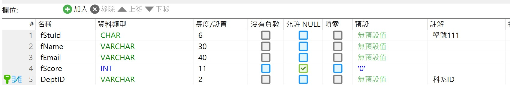
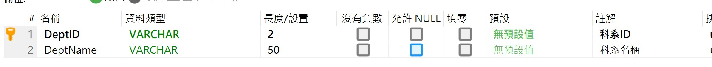

選擇DBFirst_MySql1為啟動專案
套件管理主控台的預設專案選擇DBFirst_MySql1
Scaffold-DbContext生成Model操作：\
Scaffold-DbContext "Server='127.0.0.1';Database='dbstudents';User='root';Password='autc007'" Pomelo.EntityFrameworkCore.MySql -OutputDir Models -NoOnConfiguring -UseDatabaseNames -NoPluralize -Force

## 生成Model時自動加入註解
資料庫上如果有填入註解，生成Model時會自動加入註解

重新生成Model時，須關閉Model檔案，否則不會反應出資料表上的變動

e.g. 資料表上新增了欄位，需先將對應的Model檔案關閉，再重新執行Scaffold-DbContext，Model檔才會跑出新的欄位屬性

## 把驗證規則和顯示名稱獨立，避免自動重新生成Model時被覆蓋
<h3>1. 使用部分類別（Partial Classes）</h3>
EF Core 生成的模型通常是 partial 類別，這允許您在另一個檔案中擴展該類別，而不會被重新生成的模型覆蓋。

實現步驟：

<ol>
	<li>創建一個新的部分類別檔案： 在與模型相同的命名空間中創建一個新的檔案，例如 tstudent2.Metadata.cs。</li>
	<li>定義部分類別並應用元數據類別： 使用 [MetadataType] 屬性將顯示名稱和驗證規則移動到元數據類別中。</li>
</ol>
	
<h3>2. 元數據類別的實現</h3>
元數據類別用於定義顯示名稱和驗證規則，並與模型類別分離。

<h3>3. 優勢</h3>
<ul>
	<li>避免覆蓋：重新生成模型時，元數據類別不會被影響。</li>
	<li>分離關注點：顯示名稱和驗證規則與模型邏輯分離，代碼更清晰。</li>
	<li>易於維護：可以單獨修改元數據類別，而不影響模型的其他部分。</li>
</ul>

<h3>4. 注意事項</h3>
<ol>
	<li>命名空間一致： 確保元數據類別與模型類別在相同的命名空間中，否則 [MetadataType] 屬性無法正確應用。</li>
	<li>EF Core 不支持直接生成元數據類別： 您需要手動創建元數據類別，這是避免覆蓋的代價。</li>
	<li>驗證規則的應用： 確保 Razor Pages 或控制器中的模型綁定和驗證邏輯正確應用這些規則。</li>
	<li>[MetadataType]的不支援：</li>
	<ol>
		<li>[MetadataType] 屬性並不是 EF Core 原生支持的功能。這是因為 [MetadataType] 是 ASP.NET 的功能，主要用於舊版的 ASP.NET MVC 和 Web Forms，而不是 EF Core。</li>
		<li>從 ASP.NET Core 開始（包括 Razor Pages 和 ASP.NET Core MVC），[MetadataType] 屬性已不再是框架的原生功能。這是因為 ASP.NET Core 的設計目標是輕量化和模組化，並且與舊版的 ASP.NET Framework（如 ASP.NET MVC 5 和 Web Forms）有顯著的架構差異。因此目前ASP.NET MVC已不支援使用Metadata擴展</li>
	</ol>	
</ol>

<h3>總結</h3>

通過使用 部分類別 和 元數據類別，您可以將顯示名稱和驗證規則從模型中分離，避免在重新生成模型時被覆蓋。這是一種標準且推薦的做法，特別是在使用 EF Core 的 DB First 開發模式時。By GitHub Copilot
