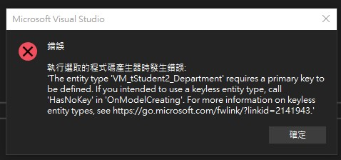
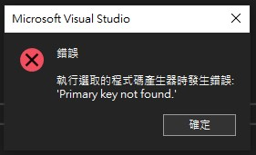

## Scaffold-DbContext生成Model操作
<ol>
	<li>選擇DBFirst_MySql2為啟動專案</li>
	<li>檢視->其他視窗->開啟套件管理器主控台</li>
	<li>套件管理器主控台的預設專案選擇DBFirst_MySql2</li>
	<li>執行以下指令：Scaffold-DbContext "Server='127.0.0.1';Database='dbstudents';User='root';Password='autc007'" Pomelo.EntityFrameworkCore.MySql -OutputDir Models -NoOnConfiguring -UseDatabaseNames -NoPluralize -Force</li>
</ol>

# 註解（Data Annotations）
[Key]、[ForeignKey] 是「註解（Data Annotations）」，EF 比較偏好 Fluent API
Data Annotations 比較簡單但有限（無法描述複合鍵、細緻行為）

EF Scaffold 工具會產生 OnModelCreating 方法，在其中用 fluent API 設定主鍵、外鍵等關聯

## 為什麼不會自動加上 [Key] 和 [ForeignKey]？
這是 MVC（特別是 ASP.NET MVC / ASP.NET Core）在進行 資料庫反向工程（Database-First） 或 Scaffold-DbContext 時的預設行為之一，以下是為什麼不會自動加上 [Key] 和 [ForeignKey] 的原因。
當使用Scaffold-DbContext命令生成Model時，Entity Framework會：
<ul>
	<li>根據主鍵約束自動辨認並建立 HasKey(...)</li>
	<li>根據外鍵約束建立 .HasOne(...)、.WithMany(...) 等 fluent API 關聯，而不是用 Data Annotations（如 [Key]），原因是 Fluent API 更強大、更具彈性。</li>
</ul>

## 使用ViewModel來生成View時會發生的錯誤
Entity Framework Core 在處理 VM_tStudent2_Department 這個型別時，發現它沒有主鍵（Primary Key）。
在 EF Core 中，所有的實體（Entity）預設都必須有主鍵，這樣才能追蹤和管理資料。

什麼情況會發生這個錯誤？

<ul>
	<li>把 VM_tStudent2_Department 當作資料表（Entity）來查詢或註冊到 DbContext，但它其實只是 ViewModel（通常用來傳遞資料到 View，不是資料表）。</li>
	<li>或者想讓它對應到資料庫的 View 或查詢結果，但沒有主鍵。</li>
</ul>
如果它只是 ViewModel，不應該加到 DbContext，
請確認 dbstudentsContext 裡面沒有 DbSet<VM_tStudent2_Department>，也不要用 EF Core 查詢這個型別。

