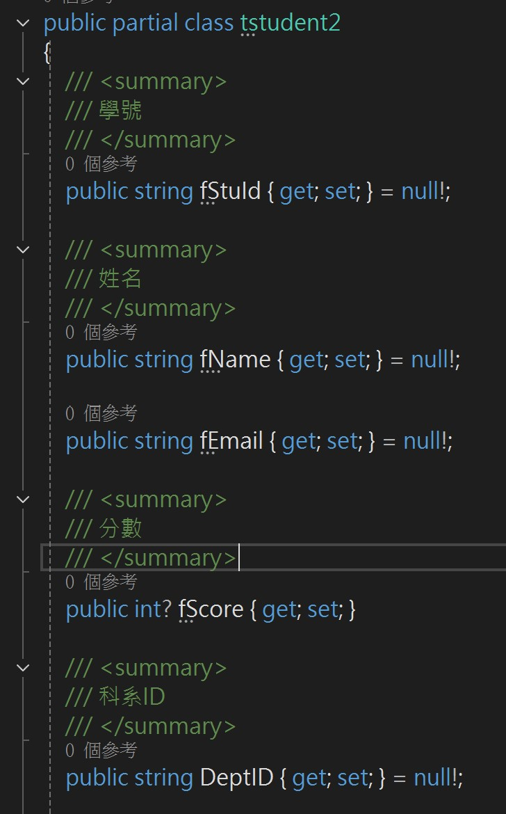

選擇DBFirst_Test為啟動專案
套件管理主控台的預設專案選擇DBFirst_Test
Scaffold-DbContext生成Model操作：\
Scaffold-DbContext "Server='127.0.0.1';Database='dbstudents';User='root';Password='autc007'" Pomelo.EntityFrameworkCore.MySql -OutputDir Models -NoOnConfiguring -UseDatabaseNames -NoPluralize -Force

## 生成Model時自動加入註解
資料庫上如果有填入註解，生成Model時會自動加入註解

重新生成Model時，須關閉Model檔案，否則不會反應出資料表上的變動

e.g. 資料表上新增了欄位，需先將對應的Model檔案關閉，再重新執行Scaffold-DbContext，Model檔才會跑出新的欄位屬性